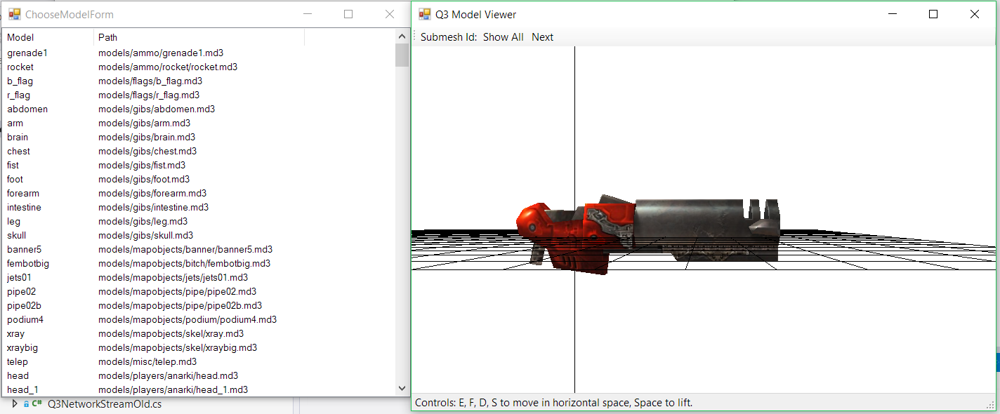

# Quake 3 Map/Model viewer and incomplete client #

Here you can find variety of Quake 3 Arena related utilities
that I programmed during examination of this game.
Amongst them:

- Map viewer.
- Model viewer.
- Network client with ability to send actual commands to the character you control.

### How to use ###
- Open `q3bot.sln`, set `Q3Renderer.csproj` as the StartUp project.
- Compile it.

#### If you have Quake 3 Arena installed on your pc ####
- Put the `Q3Renderer\bin\Debug\Q3Renderer.exe` file into the Quake 3 Arena subfolder where `pak0.pk3` file is located.

This will allow you to browse all the game data that you have in the same folder as the executable file.

#### If you don't have Quake 3 Arena installation ####
- Just run the project with `F5`,
it will load data from the free-to-redistribute data package shipped with this project.
This package contains only single map and no models.

Note that some textures will be displayed as `Texture not found` stub.
That's because mapmakers tends to reuse textures and refer them from the standard assets of the game,
which are not free to redistribute and therefore are not included in the pack shipped with this project.

### Map viewer ###
Here's what you see after starting up the application:

Pick `LargeIcon` menu item if you want the map list to be displayed with the thumbnails.

Double click the map that you want to load.
Use `E`, `F`, `D`, `S` and `Space` keys to fly around.

### Model viewer ###
Open up the **Map viewer**.
Click the `Model Viewer` button.

Window displaying list of the models from the game data packages appears.

Click the model you want to see and fly around with the `E`, `F`, `D`, `S` and `Space` keys.

